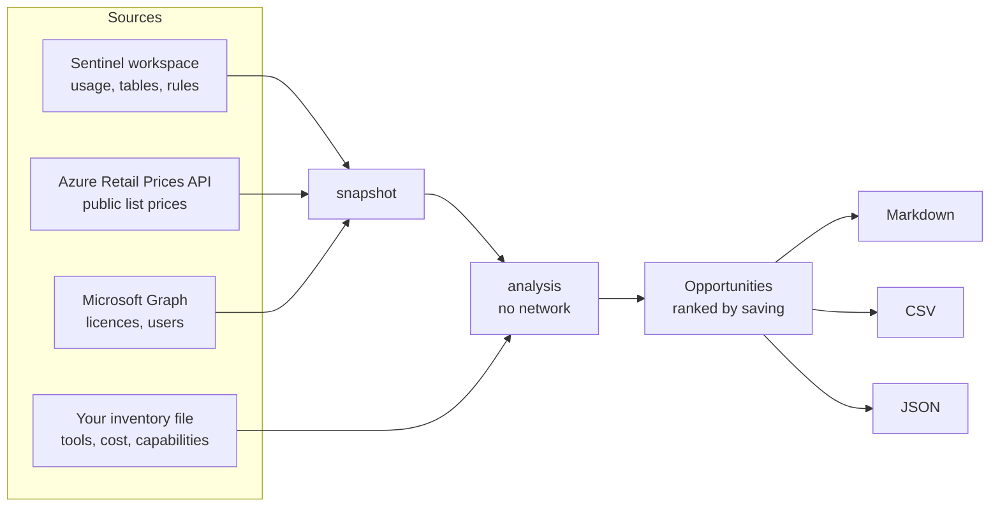

# cloud-security-optimization

[](https://github.com/as70023333/cloud-security-optimization/actions/workflows/ci.yml)


**Find what your security stack costs, what is unused, and what you are paying for twice.**

`secopt` is a read-only command-line tool with three reviews:

| Command | Question it answers | Reads from |
|---|---|---|
| `secopt sentinel` | What does each Microsoft Sentinel table cost, is the pricing plan the cheapest one, and which tables does no detection read? | Your Sentinel workspace + public Azure list prices |
| `secopt licenses` | Which Microsoft 365 licences are unassigned, sitting on disabled or inactive accounts, or duplicated by a suite the user already has? | Microsoft Graph |
| `secopt overlap` | Which security tools do the same job, which could be retired, and which required capabilities does nothing cover? | An inventory file you write |

Each one produces a ranked list of opportunities with the saving, the evidence and what to do
about it, as Markdown (to read), CSV (to track) and JSON (to automate).

Try it in 30 seconds, with no account and no credentials:

```bash
git clone https://github.com/as70023333/cloud-security-optimization.git
cd cloud-security-optimization
python3 -m secopt sentinel --demo
python3 -m secopt licenses --demo
python3 -m secopt overlap --demo
```

```text
Opportunities: 7, up to $4,668 a month
      $4,668  Switch to 100 GB/day commitment tier
      $1,061* No analytics rule reads AADNonInteractiveUserSignInLogs
      $1,037* AzureDiagnostics ingestion jumped
        $772* No analytics rule reads DeviceNetworkEvents
        $581* No analytics rule reads AzureDiagnostics
        $297* No analytics rule reads StorageBlobLogs
           -  Interactive retention longer than 90 days
  * overlaps with other items; not included in the total
Report: reports/sentinel-cost-2026-10-01.md
```

Full sample reports: [Sentinel cost](examples/reports/sentinel-cost.md) ·
[licences](examples/reports/license-review.md) · [tool overlap](examples/reports/tool-overlap.md).
The demo data is fictional.

---

## Contents

- [Who it is for](#who-it-is-for)
- [What it does](#what-it-does)
- [Why it exists](#why-it-exists)
- [When to run it](#when-to-run-it)
- [Where it runs](#where-it-runs)
- [How to use it](#how-to-use-it)
  - [Install](#install)
  - [Sign in](#sign-in)
  - [Sentinel cost review](#sentinel-cost-review)
  - [Licence review](#licence-review)
  - [Tool overlap review](#tool-overlap-review)
  - [Options shared by every command](#options-shared-by-every-command)
  - [Reports](#reports)
  - [Snapshots](#snapshots)
  - [Running it on a schedule](#running-it-on-a-schedule)
- [What it will not tell you](#what-it-will-not-tell-you)
- [Safety](#safety)
- [Troubleshooting](#troubleshooting)
- [Project layout](#project-layout)
- [Tests](#tests)
- [Related projects](#related-projects)

---

## Who it is for

| You are | You use it to |
|---|---|
| A security engineer or SOC lead | See which log tables cost the most and whether any detection uses them, before the next budget conversation |
| A security manager or CISO | Walk into a renewal knowing which tools overlap and which licences nobody uses |
| An IT or licensing admin | Get the list of licences on disabled and inactive accounts, by name, ready to reclaim |
| A consultant or MSP | Run the same repeatable review for each customer and hand over a report |

You do not need to be a developer. If you can run a command and sign in to Azure, you can run it.

## What it does



**Sentinel cost review** (`secopt sentinel`)

- Average and peak billable ingestion, and what it costs a month.
- Every pricing plan (pay-as-you-go and each commitment tier) priced against the ingestion you
  actually had, day by day, and the cheapest one named. Only Analytics-plan tables count toward a
  commitment tier; Basic-plan tables are priced at the Basic rate.
- Cost per table, with its plan, retention, 7-day trend and the number of enabled analytics rules
  that read it.
- Tables you pay for that no analytics rule reads.
- Tables whose ingestion jumped in the last 7 days, including tables that only just appeared.
- Tables kept in interactive retention longer than the 90 days Sentinel includes.

**Licence review** (`secopt licenses`)

- Licences bought and assigned to nobody.
- Licences on disabled accounts.
- Licences on accounts that have not signed in for 90 days (you choose the number).
- Standalone licences assigned to people whose suite already includes them, worked out from your
  tenant's own service plans rather than a product list that goes stale.
- Each licence is counted once, and valued at the prices you give it.

**Tool overlap review** (`secopt overlap`)

- A capability matrix: for 46 security capabilities in 9 domains, which of your tools provides each.
- Tools you pay for separately whose every capability is already covered by another tool.
- Capabilities provided by more than one tool.
- Required capabilities that nothing covers.

## Why it exists

Security budgets grow one purchase at a time. A SIEM is sized once and never revisited. Log
sources are connected because they might be useful. A suite licence is bought that includes an
EDR, and the old EDR is renewed anyway. People leave and their licences stay.

None of this is hard to fix. It is hard to *see*, because the evidence is spread across a billing
page, a licence portal, a contracts folder and a few people's heads. This tool puts the evidence
in one report, with a number you can check and the action to take.

Three things it is careful about:

- **It does not invent numbers.** No price, no saving: you get the count or the volume instead.
- **It does not double count.** Savings that overlap are marked and left out of the total.
- **It does not hide what it could not read.** A missing permission shows up as a note in the
  report, never as a clean result.

How every figure is calculated: [docs/how-the-numbers-work.md](docs/how-the-numbers-work.md).

## When to run it

| When | Which review |
|---|---|
| Two to three months before a renewal or true-up | `licenses` and `overlap` |
| When the Sentinel bill goes up and nobody knows why | `sentinel` (look at the "ingestion jumped" findings) |
| After connecting a new data source to Sentinel | `sentinel`, a week or two later |
| Before buying a new security tool | `overlap`, to check you do not already own the capability |
| Monthly or quarterly, as a habit | All three; compare with last time |
| After a re-organisation or a round of leavers | `licenses` |

## Where it runs

Anywhere Python 3.11 or newer runs: Windows, macOS, Linux, Azure Cloud Shell, a CI job, an Azure
Automation account. It uses only the Python standard library: **no third-party packages at run
time**, so there is nothing extra to keep patched. Run from a clone, it needs nothing from the
internet at all (`pip install .` fetches `setuptools` to build the package).

It needs outbound HTTPS to Microsoft's sign-in, Azure Resource Manager, Log Analytics, Graph and
the public Azure price list (`prices.azure.com`) for the two live reviews. `HTTPS_PROXY` is
honoured, from the environment or from `.env`. `secopt overlap` and every `--demo` run work fully offline.

## How to use it

### Install

Run it straight from the clone:

```bash
python3 -m secopt --help
```

Or install the `secopt` command:

```bash
python3 -m pip install .
secopt --help
```

On Windows use `py` in place of `python3`.

### Sign in

`secopt overlap` needs no sign-in. For `sentinel` and `licenses`, the simplest way is the
[Azure CLI](https://learn.microsoft.com/cli/azure/install-azure-cli):

```bash
az login
```

For scheduled runs use an app registration or a managed identity instead. Copy `.env.example` to
`.env` and fill it in, or set the same names as environment variables:

```bash
cp .env.example .env
```

| Setting | Meaning |
|---|---|
| `AZURE_TENANT_ID`, `AZURE_CLIENT_ID`, `AZURE_CLIENT_SECRET` | App registration with a client secret |
| `USE_MANAGED_IDENTITY=true` | Use the managed identity of the Azure resource it runs on |
| `AZURE_AUTH` | Force one: `secret`, `managed_identity` or `cli` |
| `SENTINEL_WORKSPACE_RESOURCE_ID` | The workspace, so you do not have to pass `--workspace` |
| `CURRENCY` | Currency for list prices (default `USD`) |

What access each review needs, and how to grant it: [docs/permissions.md](docs/permissions.md).
In short:

| Review | Needs |
|---|---|
| `sentinel` | **Microsoft Sentinel Reader** (or Log Analytics Reader) on the workspace |
| `licenses` | Graph `Organization.Read.All` and `User.Read.All`; `AuditLog.Read.All` for the inactive-account check |
| `overlap` | Nothing |

### Sentinel cost review

```bash
secopt sentinel --workspace /subscriptions/<id>/resourceGroups/<rg>/providers/Microsoft.OperationalInsights/workspaces/<name>
```

Find the resource ID in the Azure portal (the workspace's **Properties** page), or with:

```bash
az monitor log-analytics workspace show --resource-group <rg> --workspace-name <name> --query id -o tsv
```

| Option | Meaning | Default |
|---|---|---|
| `--workspace ID` | Full resource ID of the Log Analytics workspace | `SENTINEL_WORKSPACE_RESOURCE_ID` |
| `--days N` | Days of usage to collect, 7 to 90. Use 14 or more: growth is measured against the days before the last 7 | 30 |
| `--price-per-gb PRICE` | Your pay-as-you-go price per GB, instead of the list price | list price for the region |
| `--currency CODE` | Currency for list prices | `USD` |

Examples:

```bash
secopt sentinel --workspace <id> --days 60            # a longer window smooths out one-off spikes
secopt sentinel --workspace <id> --price-per-gb 3.10  # value it at your negotiated rate
secopt sentinel --workspace <id> --currency EUR
```

How to read the result:

- **Start with the pricing plan.** It is usually the largest saving and the smallest change.
  A commitment tier is fixed for 31 days, so check the volume is steady first.
- **Then the tables no rule reads.** These are questions, not verdicts: a table may be there for
  investigations, hunting or compliance. If so, it may belong on a cheaper plan. If nobody can say
  what it is for, stop collecting it.
- **Then the jumps.** A table that doubled last week is usually a misconfigured source, and it is
  cheapest to fix now.

### Licence review

```bash
secopt licenses --prices my-prices.toml
```

Without `--prices` the review still runs and counts everything; it just cannot put a value on it.
The price file is a short list of what **you** pay per user per month, by product part number:

```toml
currency = "USD"

[prices]
SPE_E5 = 57.00
SPE_E3 = 36.00
AAD_PREMIUM_P2 = 9.00
```

Start from [examples/license-prices.example.toml](examples/license-prices.example.toml). The
numbers in it are placeholders. To find your part numbers, run `secopt licenses` once without
prices and look at the `part_number` column in the products CSV.

| Option | Meaning | Default |
|---|---|---|
| `--prices FILE` | Your price per user per month, by part number | none (counts only) |
| `--inactive-days N` | Days without a sign-in before an account counts as inactive | 90 |

How to read the result:

- **Unassigned** licences are the safest saving: reduce the quantity at renewal.
- **Disabled accounts** keep their licences until someone removes them. Group-based licensing
  stops this from recurring.
- **Inactive accounts** need a human look. Shared mailboxes, service accounts, break-glass
  accounts and people on leave all appear here. The report names the accounts so you can check.
- **Duplicates** are standalone add-ons left on a user after they were upgraded to a suite.

### Tool overlap review

Describe your stack in a TOML file. Start from
[examples/security-stack.toml](examples/security-stack.toml):

```toml
currency = "USD"
required = ["pam"]        # needed in addition to the baseline
not_required = []         # baseline capabilities that do not apply to you

[[tool]]
name = "Microsoft Defender for Endpoint"
vendor = "Microsoft"
bundled_with = "Microsoft 365 E5"     # no separate cost: it comes with a licence
capabilities = ["antivirus", "edr", "vulnerability-management"]

[[tool]]
name = "Acme EDR"
vendor = "Acme"
annual_cost = 54000                   # what you pay for it on its own each year
capabilities = ["antivirus", "edr"]
```

Then:

```bash
secopt overlap my-stack.toml
secopt overlap --list-capabilities     # the capability names you can use
```

| Field | Meaning |
|---|---|
| `name` | What you call the tool (required, unique) |
| `vendor` | Who you buy it from |
| `annual_cost` | What you pay for it on its own each year; leave out if it is bundled |
| `bundled_with` | The licence that includes it, when it has no separate cost |
| `capabilities` | What it does, from `--list-capabilities` (required) |
| `notes` | Anything you want to remember, such as the renewal date |

A misspelled capability or an unknown field is an error that names the tool it is on, never a
silently wrong report.

How to read the result:

- **"Fully covered by other tools"** means every capability on that tool's list also appears on
  another tool you are keeping. It is the starting point for a comparison, not a decision: two
  tools can both "do EDR" at very different depth.
- **Gaps** are measured against a baseline of 14 capabilities most organizations need. Adjust it
  with `required` and `not_required`. Check whether a licence you already own covers a gap before
  buying something.

### Options shared by every command

| Option | Meaning | Default |
|---|---|---|
| `--demo` | Use built-in fictional data; no sign-in | off |
| `--out DIR` | Where to write reports | `reports` |
| `--format LIST` | Any of `md`, `csv`, `json`, comma-separated | all three |
| `--env-file PATH` | Settings file to load | `.env` |
| `--quiet` | Print only the report paths | off |
| `--snapshot FILE` | Analyse data saved earlier instead of collecting (`sentinel`, `licenses`) | |
| `--save-snapshot FILE` | Also save the collected data (`sentinel`, `licenses`) | |

Exit codes: `0` the review ran, `2` it could not (bad arguments, no sign-in, no access). Finding
opportunities is not a failure, so it does not change the exit code.

### Reports

Each review writes four files. `<name>` is `sentinel-cost-<date>`, `license-review-<date>` or
`tool-overlap`, where the date is the day the data was collected. The overlap review has no date
because its input is a file you keep: put the inventory in version control to see how it changes.

| File | Contents |
|---|---|
| `<name>.md` | The readable report: summary, ranked opportunities with what to do, detail tables, notes |
| `<name>-opportunities.csv` | One row per opportunity, for a tracker or spreadsheet |
| `<name>-tables.csv` / `-products.csv` / `-matrix.csv` | The detail behind it: every table, product or capability |
| `<name>.json` | Everything above, for dashboards and automation |

Every opportunity has the same fields:

| Field | Meaning |
|---|---|
| `title` | What was found |
| `monthly_saving` | The estimate, or empty when there is no honest way to put a number on it |
| `additive` | `False` when the saving overlaps with others and is left out of the total |
| `effort` | `low`, `medium` or `high` |
| `detail` | The evidence |
| `action` | What to do |

### Snapshots

`--save-snapshot` writes the collected data to a file; `--snapshot` analyses that file later with
no sign-in. Use it to:

- collect once with a privileged identity and analyse elsewhere;
- re-run with different settings (`--price-per-gb`, `--inactive-days`, `--prices`) without
  collecting again;
- keep a monthly record and compare.

```bash
secopt licenses --save-snapshot snapshot-licenses.json
secopt licenses --snapshot snapshot-licenses.json --prices my-prices.toml --inactive-days 60
```

A snapshot from one review is refused by the other, so you cannot get an empty report by mistake.

### Running it on a schedule

A monthly GitHub Actions job, with the app registration's details stored as repository secrets:

```yaml
name: Monthly security cost review
on:
  schedule:
    - cron: "0 7 1 * *"
permissions:
  contents: read
jobs:
  review:
    runs-on: ubuntu-latest
    steps:
      - uses: actions/checkout@v4
        with:
          repository: as70023333/cloud-security-optimization
      - uses: actions/setup-python@v5
        with:
          python-version: "3.12"
      - run: python -m pip install .
      - run: |
          secopt sentinel
          secopt licenses
        env:
          AZURE_TENANT_ID: ${{ secrets.AZURE_TENANT_ID }}
          AZURE_CLIENT_ID: ${{ secrets.AZURE_CLIENT_ID }}
          AZURE_CLIENT_SECRET: ${{ secrets.AZURE_CLIENT_SECRET }}
          SENTINEL_WORKSPACE_RESOURCE_ID: ${{ secrets.SENTINEL_WORKSPACE_RESOURCE_ID }}
      - uses: actions/upload-artifact@v4
        with:
          name: security-cost-review
          path: reports/
          retention-days: 30
```

Run this in a **private** repository: the reports name your users and tables.

## What it will not tell you

Being clear about the limits is part of the tool.

- **Prices are list prices** unless you supply your own. Your agreement is probably different.
- **"No rule reads it" is not "nobody needs it".** Hunting queries, workbooks, playbooks and
  analysts read tables too, and a rule that reaches a table through a parser function is not
  detected.
- **Sentinel benefits are not modelled**: the Microsoft 365 E5 data grant, the Defender for
  Servers allowance, dedicated clusters, and the classic two-meter pricing. If you have them, your
  real bill is lower than the estimate.
- **Only the Analytics and Basic plans are priced.** Tables on other plans (Auxiliary, for
  example) are shown by volume, and the report says so.
- **A sign-in is not usage.** The licence review knows whether someone signed in, not whether
  they use what the licence pays for.
- **A capability label is not depth.** The overlap review knows two tools both claim a
  capability, not how well each does it.
- **A saving is only real at renewal**, and contract terms decide when that is.
- **The live collection has been tested against simulated API responses**, built from Microsoft's
  documented response formats, not against a production tenant. The Azure Retail Prices API call
  was checked against the live service. If a response in your tenant looks different, please
  open an issue with the error message.

Details: [docs/how-the-numbers-work.md](docs/how-the-numbers-work.md).

## Safety

- **Read-only.** It changes nothing in Azure, Sentinel or Microsoft 365. The one `POST` it sends
  is a Log Analytics query.
- **No telemetry.** It talks to Microsoft's APIs and nowhere else.
- **Tokens stay with their host.** Redirects are never followed, and a paging link that points
  to another host, or to the same host over plain http, is refused.
- **Secrets are never printed.** Error messages leave out query strings and credentials.
- **Names are treated as untrusted input.** HTML, links, images, headings and code blocks in
  names from your tenant, a snapshot or an inventory are neutralised in Markdown, and spreadsheet
  formulas are neutralised in CSV. A snapshot cannot make a report land outside the output folder.
- **Reports are private by default.** `reports/`, snapshots, `.env` and `my-*.toml` are in
  `.gitignore`.

## Troubleshooting

| Message | Cause and fix |
|---|---|
| `pass --workspace <resource id>` | No workspace given. Pass `--workspace` or set `SENTINEL_WORKSPACE_RESOURCE_ID` |
| `workspace must be a full resource ID` | You passed the workspace name or its GUID. Use the full `/subscriptions/...` path |
| `Azure CLI not found` | No sign-in method available. Install the Azure CLI and run `az login`, or set the app registration variables |
| `could not read the workspace ...` | The identity cannot read the workspace. Grant Microsoft Sentinel Reader (or Log Analytics Reader) on the workspace or its resource group |
| `... is not a valid snapshot` | The snapshot file was edited or is damaged. Collect it again with `--save-snapshot` |
| Note: `trend: only N day(s) of data` | Fewer than 14 days were analysed, so growth was not measured. Use `--days 14` or more |
| `no ingestion data to analyse` | The `Usage` query returned nothing: wrong workspace, or the identity cannot query it |
| `could not read licences ... Grant Organization.Read.All` | Missing Graph permission or admin consent |
| Note: `sign-in activity unavailable` | `AuditLog.Read.All` is missing or the tenant has no Entra ID P1. Everything else still ran |
| Note: `no Microsoft Sentinel prices published for region` | No list price for that region and currency. Pass `--price-per-gb` |
| `unknown capability` | A capability name in your inventory is not in the vocabulary. Run `secopt overlap --list-capabilities` |
| `is a 'licenses' snapshot` | You passed a snapshot from the other review |

## Project layout

```text
secopt/
  cli.py                  the secopt command
  report.py               Markdown, CSV and JSON reports
  core/                   HTTP client with retries, Azure sign-in, .env loading, output helpers
  sentinel/
    collect.py            reads the workspace, tables, rules, Usage and list prices
    analyze.py            plan comparison, per-table cost, unread tables, spikes, retention
    demo.json             fictional workspace
  licenses/
    collect.py            reads subscribedSkus and users from Graph
    analyze.py            unassigned, disabled, inactive, duplicate
    demo.json             fictional tenant
  overlap/
    capabilities.py       the capability vocabulary and baseline
    analyze.py            inventory parsing, matrix, redundancy, gaps
    demo_stack.toml       fictional company
docs/
  how-the-numbers-work.md the arithmetic behind every figure
  permissions.md          the access each review needs
examples/
  security-stack.toml     inventory to copy
  license-prices.example.toml
  reports/                sample output from the demos
tests/                    114 tests, no outside network
```

Collection and analysis are separate on purpose. Collectors produce a plain JSON snapshot;
analysers are pure functions over that snapshot. That is what makes `--snapshot`, `--demo` and
the tests possible, and it is why the analysis can be checked without access to anything.

## Tests

```bash
python3 -m unittest discover -s tests -t .
```

114 tests, run on Python 3.11, 3.12 and 3.13 in CI. They never leave the machine: HTTP goes
through a fake transport, and the two tests that need real sockets (redirects are not followed,
proxy settings are honoured) use servers on localhost. They cover the pricing arithmetic, table plans, the once-only
counting of licences, the redundancy logic, paging and retries, the permission fallbacks, damaged
snapshots, hostile names in reports, and that the sample reports in this repository match what
the code produces.

## Related projects

| Repository | What it is |
|---|---|
| [cloud-security-checks](https://github.com/as70023333/cloud-security-checks) | Read-only misconfiguration scanners for AWS, Azure and Google Cloud |
| [soc-toolkit](https://github.com/as70023333/soc-toolkit) | KQL hunting library, Entra ID audit, IOC enrichment, Defender device health, secrets scanner |
| [security-automation-lab](https://github.com/as70023333/security-automation-lab) | Wazuh and Shuffle SOAR lab |

## License

[MIT](LICENSE). Author: Alex S., Security.
